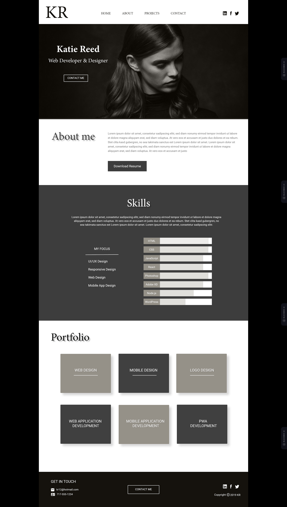

# Katie Reed Portfolio

This project was part of my training at **Digital Maroc School**, where I built a portfolio website for a character named **Katie Reed**. The goal was to create a professional and interactive portfolio to showcase Katie's skills and work.

## Overview

The website includes the following sections:
- **About**: A short introduction to Katie Reed.
- **Skills**: A list of the key skills Katie has.
- **Services**: A showcase of the services Katie provides.

## Features

- **Skills**: Highlights Katie’s core skills and expertise.
- **Services**: Displays a list of services Katie offers with descriptions.
- **Contact Buttons**: Includes email and phone number contact options in the navbar and footer, making it easy to get in touch with Katie.

## Design Reference

I based the design of this portfolio on a reference layout that was provided during the training. The aim was to replicate the design while adding my own touch to reflect Katie’s professional image.

## Technologies Used

- **HTML**
- **SCSS** (CSS preprocessor)
- **JavaScript** (for the interactive navbar)
